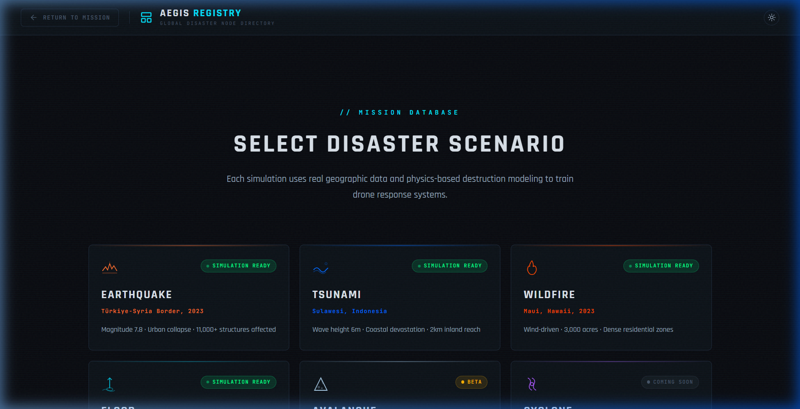
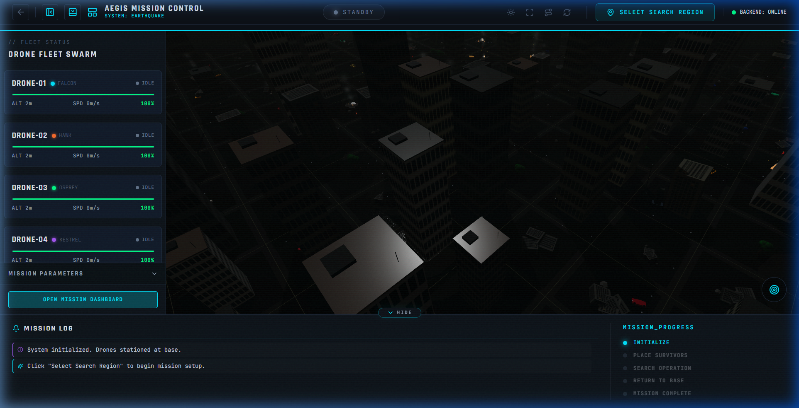
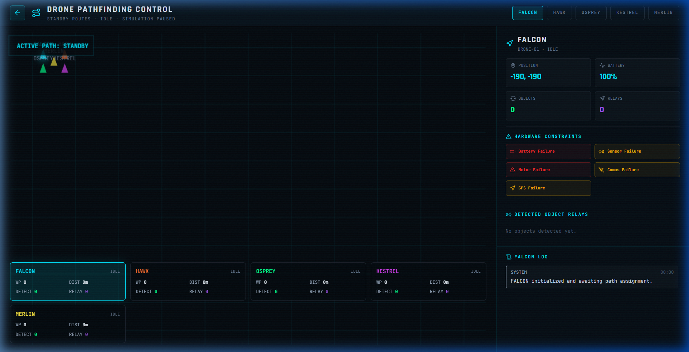

# AEGIS v1

**Autonomous drone swarm mission control platform built with React, Three.js, Python, and FastAPI for real-time disaster recovery simulation and tactical coordination.**

## Overview

AEGIS (Autonomous Emergency Ground Intelligence System) is a web-based mission control dashboard designed for deploying, monitoring, and coordinating autonomous drone swarms across active disaster zones in immersive 3D environments. Leveraging a Python physics backend with real-time WebSocket streaming and a Three.js-powered tactical interface, it enables operators and researchers to simulate multi-drone disaster response operations with full situational awareness.

**Primary Use Cases:**

- Autonomous drone swarm coordination for disaster recovery
- Real-time 3D tactical visualization of multi-drone operations
- Thermal imaging simulation and survivor detection
- A* pathfinding and zone-based patrol allocation
- Battery-aware navigation and charging station management
- Multi-scenario disaster simulation (earthquake, tsunami, wildfire, flood)
- Mission replay and telemetry data export
- Educational demonstrations for swarm robotics

## Screenshots

<p align="center">
  
  <br/>
  <em>Disaster Scenario Selector -- Choose from earthquake, tsunami, wildfire, flood, and more</em>
</p>

<br/>

<p align="center">
  
  <br/>
  <em>3D Mission Control Dashboard -- Real-time swarm telemetry with procedural urban terrain</em>
</p>

<br/>

<p align="center">
  
  <br/>
  <em>Drone Pathfinding Control -- A* path visualization with live deployment tracking</em>
</p>

## Tech Stack

### Frontend

| Category | Technology | Version |
|----------|-----------|---------|
| Frontend Framework | React | 18.3.0 |
| Build Tool | Vite | 6.0.0 |
| 3D Rendering | Three.js | 0.170.0 |
| React 3D Abstraction | @react-three/fiber | 8.17.14 |
| 3D Utilities | @react-three/drei | 9.120.4 |
| Post-Processing Effects | @react-three/postprocessing | 3.0.4 |
| Animation | Framer Motion | 12.0.0 |
| State Management | Zustand | 5.0.0 |
| Routing | React Router DOM | 6.28.0 |
| Icons | Lucide React | 0.400.0 |
| Styling | Tailwind CSS | 4.0.0 |

### Backend

| Category | Technology | Version |
|----------|-----------|---------|
| Runtime | Python | 3.10+ |
| Web Framework | FastAPI | 0.111.0 |
| ASGI Server | Uvicorn | 0.29.0 |
| Physics Engine | NumPy | 1.26.4 |
| Optimization | SciPy | 1.13.0 |
| Image Processing | OpenCV (headless) | 4.9.0.80 |
| Image Utilities | Pillow | 10.3.0 |
| Machine Learning | scikit-learn | 1.4.2 |
| WebSocket Protocol | websockets | 12.0 |

## Features

### 3D Visualization
- Real-time interactive 3D disaster scene rendering with Three.js
- Procedural urban terrain generation (100m x 100m, 20x20 grid, 5m cells)
- High-fidelity fire and smoke particle simulation
- Post-processing effects (bloom, depth of field) for visual enhancement
- Smooth camera controls with orbit and zoom navigation

### Multi-Drone Swarm Control
- 5 autonomous drones operating with decentralized zone allocation (FALCON, HAWK, OSPREY, KESTREL, MERLIN)
- 3D trajectory trail rendering with last 200 position history per drone
- Real-time battery, velocity, altitude, and status telemetry per unit
- WebSocket-driven state synchronization at 20 Hz refresh rate
- Automated charging station docking at 5 positions (corners + center)

### Thermal Imaging & Survivor Detection
- Simulated thermal camera feed (320x240, INFERNO colormap, 30 fps)
- Probabilistic survivor detection based on distance, altitude, and noise
- Scenario-specific thermal noise degradation (earthquake: 15%, wildfire: 45%)
- Detection event logging with confidence scoring and evacuation alerts
- RGB camera feed simulation (48 MP equivalent)

### Pathfinding & Navigation
- A* pathfinding with hazard-weighted cost functions on grid-based terrain
- Zone-based patrol allocation with automated sector assignment
- Battery-aware return-to-base logic with threshold monitoring
- Dedicated pathfinding visualizer page with step-by-step rendering

### Mission Control Dashboard
- Dual-panel layout: drone status cards + sensor feeds and event logs
- Drone coordination panel with proximity encounter tracking
- Mission replay system for post-operation analysis
- Data export capabilities for mission telemetry
- Real-time notification center for critical alerts

### 2D Tactical Mapping
- Antique-styled "Treasure Map" 2D tactical plot synchronized with 3D scene
- Area scan coverage visualization with drone position overlays
- Survivor marker placement with detection status indicators
- Radar sweep visualization for area monitoring

### Edge Case & Fault Handling
- Drone failure simulation with diagnostic modal overlays
- Obstacle detection and dynamic obstacle log panel
- Recovery monitoring panel with automated fault response
- Edge case scripting system for testing failure scenarios

### Disaster Scenarios
- **Earthquake** -- Turkey/Syria 2023 (37.17N, 36.95E) -- urban rubble, structural collapse
- **Tsunami** -- Indonesia 2018 (6.10S, 105.42E) -- coastal flooding, debris fields
- **Wildfire** -- Hawaii 2023 (20.89N, 156.68W) -- extreme heat, smoke obscuration
- **Flood** -- Pakistan 2022 (27.50N, 68.50E) -- water level rise, limited landing zones

### Landing Page
- Interactive 3D globe hero section with animated Earth rendering
- Animated stat counters (2.3s deployment, 94.7% detection, 5 drones per zone)
- Scenario selection grid with detailed scenario cards
- Edge case demonstration grid
- Smooth page transitions with Framer Motion

## Installation & Setup

### Prerequisites

- Node.js v18 or higher
- npm or yarn package manager
- Python 3.10 or higher
- pip package manager
- Git

### Clone Repository

```bash
git clone https://github.com/sumans-19/AEGIS---V1.git
cd AEGIS---V1
```

### Install Dependencies

**Backend:**

```bash
cd backend
python -m venv .venv
```

Activate the virtual environment:

```bash
# Windows
.venv\Scripts\activate

# macOS / Linux
source .venv/bin/activate
```

Install Python packages:

```bash
pip install -r requirements.txt
```

**Frontend:**

Open a new terminal in the project root:

```bash
npm install
```

This command will install all required packages listed in `package.json`.

### Running the Application

#### Start Backend Server

```bash
cd backend
python main.py
```

The backend API and WebSocket server will launch at `http://localhost:8000` with automatic reload on code changes.

#### Start Frontend Dev Server

Open a new terminal in the project root and start the development server with hot module replacement:

```bash
npm run dev
```

The application will launch at `http://localhost:5173` with automatic reload on code changes.

#### Quick Start (One Command)

Use the bundled launcher scripts to start both servers automatically:

```bash
# Windows
start.bat

# macOS / Linux
chmod +x start.sh && ./start.sh
```

### Endpoints

| Service | URL |
|---------|-----|
| Frontend Dashboard | http://localhost:5173 |
| Backend API | http://localhost:8000 |
| WebSocket Feed | ws://localhost:8000/ws |
| Swagger API Docs | http://localhost:8000/docs |

## Performance Metrics

### Language Composition

```
JavaScript (JSX):  596,361 bytes  (90.66%)
Python:             53,949 bytes  ( 8.20%)
CSS:                 6,617 bytes  ( 1.01%)
HTML:                  869 bytes  ( 0.13%)
```

### Build Performance

| Metric | Value |
|--------|-------|
| Dev Server Startup | < 1 second with Vite |
| HMR Update Time | < 100 ms |
| Physics Tick Rate | 20 Hz (50 ms per tick) |
| WebSocket Broadcast Rate | 20 Hz |
| Control-to-Render Latency | < 100 ms |
| 3D Rendering | 60 FPS on modern hardware |
| Thermal Feed | 320 x 240 @ 30 fps |
| Concurrent Drones | 5 (extensible to 50+) |
| Terrain Resolution | 20 x 20 grid (5 m per cell) |
| Simulation Speed Range | 0.5x -- 4x (configurable) |

### Hardware Reference (Simulation Baseline: DJI Matrice 300 RTK)

| Specification | Value |
|--------------|-------|
| Max Horizontal Speed | 19 m/s (68 km/h) |
| Max Flight Time | 55 min (cruise, no wind) |
| Battery Capacity | 2.7 kWh |
| Communication Range | 8,000 m (standard) |
| Thermal Sensor | 640 x 512 @ 30 fps, NETD 40 mK |
| Telemetry Rate | 50 Hz |
| Control Latency | 50 -- 150 ms |


## Repository Details

| Field | Value |
|-------|-------|
| Owner | sumans-19 |
| Repository | https://github.com/sumans-19/AEGIS---V1 |
| Type | Public |
| Status | Active Development |
| Created | March 2026 |
